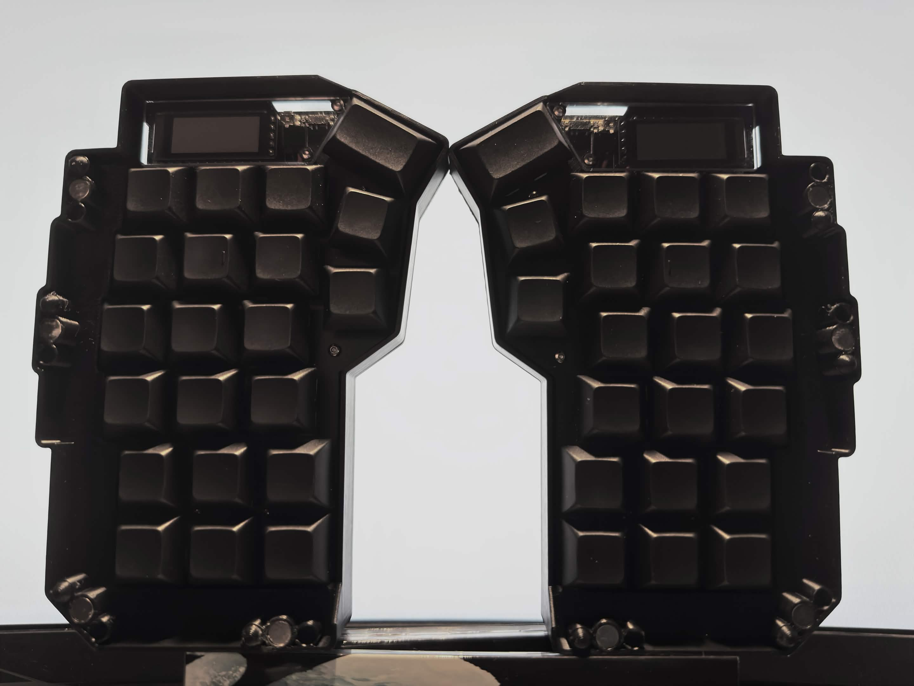
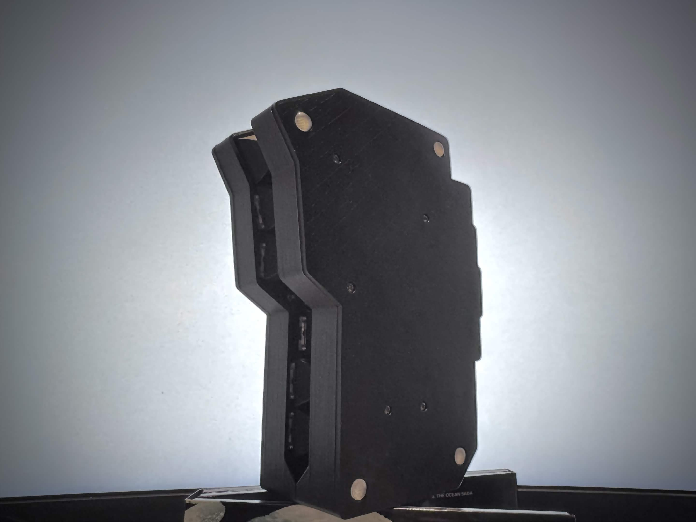
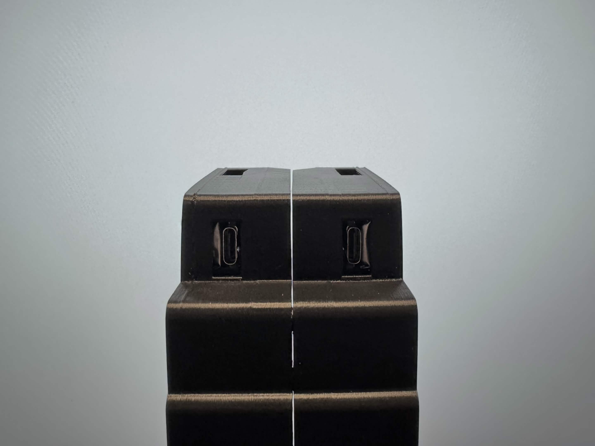
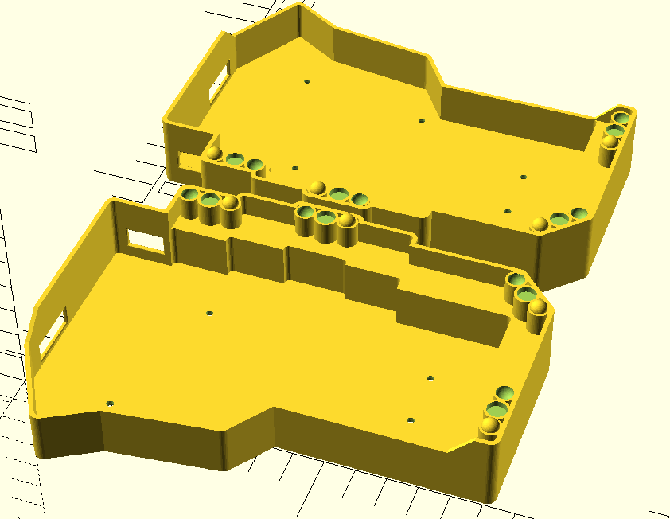

# Split Keyboard Travel Shell

A simple, customizable, 3d printed split keyboard case for throwing your keyboard into a bag with minimal bulk

Supported keyboards:

- Wireless MX Corne
- your keyboard?! (contributions welcome)

